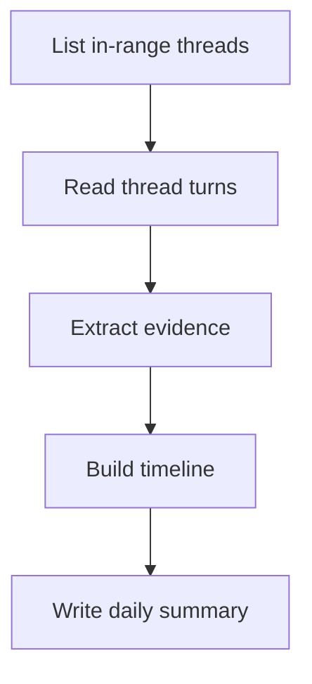

# Codex Daily Summary

Generate a daily work summary from Codex threads created during the local calendar day. Write the summary into today's Obsidian daily note as a new major section placed below the todo section.

The summary must reduce reader effort. Every claim must be traceable to thread metadata or turn content. Do not infer intent, impact, or completion without evidence.

## When to Use

- The user wants a Codex daily report, worklog, timeline, or engineering summary.
- The user wants today's Codex activity inserted into an Obsidian daily note.
- The user wants to know what work was done during one day based on thread history.

Do not use this skill for generic meeting notes, sprint reports without Codex evidence, or freeform journaling.

## Required Inputs

- Access to the Codex App Server thread APIs:
  - `thread/list`
  - `thread/read` with `includeTurns: true`
- Access to the Obsidian vault that should receive the summary.

## Workflow

### 1. Resolve the target daily note

Reuse the vault discovery and daily note resolution rules from `obsidian-daily-note-todo`.

Required behavior:

1. Find candidate Obsidian vaults by locating `.obsidian/`.
2. If more than one vault exists, ask the user which vault to use.
3. Read daily note settings from the vault.
4. Resolve today's daily note path in the user's local timezone.
5. Create today's note if needed without overwriting existing content.

Do not reimplement a different vault selection policy. Follow the same safety rules as `obsidian-daily-note-todo`.

### 2. Define the time window

Use the user's local calendar day.

Required window:

- Start: local `00:00:00`
- End: local `23:59:59.999`

Convert the bounds to Unix seconds before filtering `createdAt`.

If the user explicitly requests another day, use that local calendar day instead.

### 3. List all threads created during the day

Use `thread/list` with pagination. Sort by `created_at` descending.

Important:

- The API supports sorting, pagination, archival filtering, provider filtering, source filtering, and cwd filtering.
- The API does not document `created_after` or `created_before` query parameters.
- Time filtering must therefore be performed client-side using each thread's `createdAt`.

To avoid silently dropping non-interactive threads, pass every documented source kind instead of relying on the server default:

```json
[
  "cli",
  "vscode",
  "exec",
  "appServer",
  "subAgent",
  "subAgentReview",
  "subAgentCompact",
  "subAgentThreadSpawn",
  "subAgentOther",
  "unknown"
]
```

Pagination rule:

1. Request a page.
2. Keep threads whose `createdAt` falls inside the local day window.
3. If results are sorted descending and the oldest thread in the current page is earlier than the day start, stop after processing in-range items from that page.
4. Otherwise continue with `nextCursor`.

### 4. Read thread content

For every in-range thread, call `thread/read` with:

```json
{
  "threadId": "thr_123",
  "includeTurns": true
}
```

Extract evidence from:

- thread metadata: `id`, `name`, `preview`, `createdAt`, `updatedAt`, `modelProvider`
- turn items such as:
  - `userMessage`
  - `agentMessage`
  - `plan`
  - `reasoning`
  - `commandExecution`
  - `fileChange`
  - `mcpToolCall`
  - `dynamicToolCall`
  - `collabToolCall`

Treat `item/completed` state as authoritative when event history is available.

### 5. Determine the report language

The `SKILL.md` stays in English. The inserted daily summary must use the dominant natural language found in the fetched threads.

Use this decision order:

1. Inspect user-authored text first. This includes `userMessage` content and explicit plan text authored by the user.
2. If user-authored text is too sparse, inspect assistant-authored text such as `agentMessage`, `plan`, and `reasoning`.
3. Choose the language that dominates by volume and count across all in-range threads.
4. If two languages are close, choose the language used in the majority of user-authored text.
5. If the result is still inconclusive, use the main language already present in today's daily note.
6. If the note is empty and evidence is still inconclusive, default to English.

Do not mix languages in headings and prose unless the evidence itself requires quoting multilingual content.

## Evidence Model

Summaries must be evidence-first.

Allowed claims:

- A thread addressed a topic when the prompt, plan, or output states that topic.
- A code change happened when `fileChange` or command output shows it.
- A command was run when `commandExecution` exists.
- A task remained incomplete when the final turn shows no completion evidence.

Forbidden claims:

- Intentions not stated in the thread.
- Quality judgments without explicit evidence.
- Business impact not supported by text.
- Completion claims based only on optimism or partial progress.

If evidence is missing, state the uncertainty directly and keep the sentence short.

## Output Structure

Insert a new major section immediately below the existing todo section. If no todo section exists, create one first using the same section logic as `obsidian-daily-note-todo`, then insert the summary section under it.

Recommended English heading:

```markdown
## Daily Summary
```

Translate the heading into the detected dominant language before writing.

The section must follow this structure:

1. One opening paragraph that states the day scope, thread count, and main work themes.
2. One timeline subsection ordered by time.
3. One evidence-grounded outcome paragraph that states what changed, what was verified, and what remained open.
4. One process diagram plus steps list when the day included a complex multi-step workflow.

### Timeline format

Use time-ordered subsections. Each block should let the reader understand the work at a glance.

Required elements per block:

- time range or timestamp
- concise title derived from thread evidence
- paragraph describing the work
- explicit evidence sentence when needed
- outputs or pending items if present

Prefer this shape:

```markdown
### 09:10-10:05 Fix export path regression

The work focused on the export path used by the reporting flow. The thread shows inspection of the failing path, a targeted code change, and a follow-up verification command. The evidence consists of one `commandExecution` item for the failing test, one `fileChange` item in the export module, and a later passing verification command. The result is a repaired export path. One follow-up item remained open because the thread did not show a broader regression sweep.
```

### Complex workflows

When the day's work contains branching, retries, review loops, or multi-stage delivery, include a Mermaid flowchart followed by a numbered step list.

Use both. Do not use only one.

Example:

````markdown


1. List the threads created during the local day.
2. Read each thread with turns included.
3. Extract commands, file changes, plans, and completion evidence.
4. Order the work chronologically.
5. Write the timeline and the outcome summary into the daily note.
````

### Comparisons

When the summary needs to compare options, approaches, or outcomes, use a list. Do not use a table.

## Writing Rules

The inserted summary must follow these rules:

- Use Markdown with coherent paragraph-based prose.
- Avoid empty transition phrases such as "worth noting" or "in addition".
- Keep subject and verb close together.
- Split long sentences.
- Maintain a direct, academic engineering tone.
- Support each conclusion with theory, observed evidence, or explicit thread data.
- Prefer precise nouns and verbs over vague intensifiers.
- Use short quotations only when wording matters. Otherwise paraphrase.

## Insertion Rules

Apply these rules in order:

1. Find the todo section in today's note.
2. Insert the daily summary section directly below the todo section content.
3. If a daily summary section for the same date already exists, replace only that section instead of appending a duplicate.
4. Preserve all unrelated sections and spacing.

Recognize common todo headings case-insensitively:

- `## Tasks`
- `## Todo`
- `## Todos`
- localized equivalents already present in the note

If the note uses another established heading level, preserve the local convention.

## Minimal API Reference

### List threads

```json
{ "method": "thread/list", "id": 20, "params": {
  "cursor": null,
  "limit": 100,
  "sortKey": "created_at",
  "sourceKinds": [
    "cli",
    "vscode",
    "exec",
    "appServer",
    "subAgent",
    "subAgentReview",
    "subAgentCompact",
    "subAgentThreadSpawn",
    "subAgentOther",
    "unknown"
  ]
} }
```

### Read a thread with turns

```json
{
  "method": "thread/read",
  "id": 19,
  "params": {
    "threadId": "thr_123",
    "includeTurns": true
  }
}
```

## Common Mistakes

- Treating the server default source filter as "all threads". It is not.
- Claiming progress without a supporting message, command, or file change.
- Mixing thread creation time with last update time.
- Appending a second summary for the same date instead of replacing the existing one.
- Writing the report in English when the day's threads are primarily in another language.
- Using tables for comparisons.
- Compressing a complex workflow into prose when a Mermaid flowchart is required.
