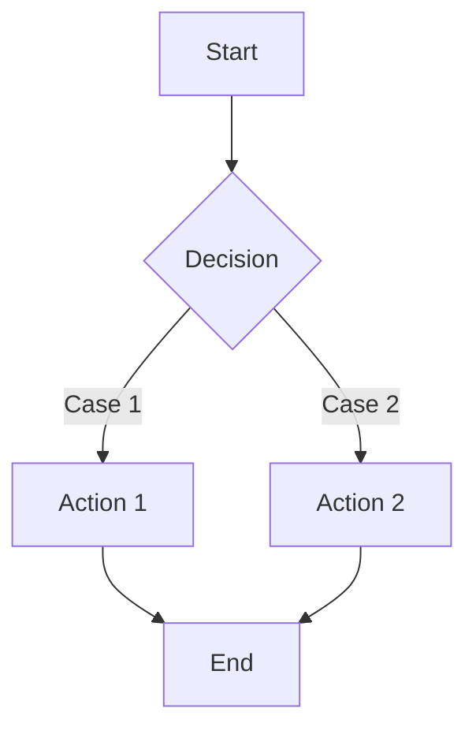

## When to Use

- The user asks for a technical proposal, architecture design, migration plan, RFC, ADR, or engineering standard.
- The user asks for natural prose instead of rigid templates.
- The output must read like a serious engineering document, not generated boilerplate.

## Output Language Policy

The proposal language must follow user preference. Style rules in this skill are language-agnostic; apply them in the selected language.

Priority order:
1. Explicit user instruction wins (for example: "write this in Chinese", "output in English").
2. If no explicit instruction exists, use the language used in the latest user request.
3. If the latest user request is mixed-language, use the dominant language in the request body.
4. If dominance is unclear, default to the language used in the immediate prior user turn.

Hard requirements:
- Do not change output language for style reasons.
- Do not add bilingual output unless explicitly requested.
- Keep technical terms in original form when translation would reduce precision, but keep narrative text in the selected language.

## Core Principles

### Minimize Cognitive Load

Every sentence consumes reader attention. A proposal exists to transfer decisions and constraints, not to perform writing style.

**Precision**: Use the fewest words that preserve exact meaning.

**Concision**: Remove words that add tone but no information.

**Logical Rigor**: State premises before conclusions; conclusions must follow directly.

**Maintainability**: Treat the document as code. It should still be clear months later.

### Engineering Tone

**Objective**: Prefer measurable claims over subjective praise.

**Domain-appropriate**: Use standard technical terms for the intended audience.

**Direct**: Lead with the conclusion, then provide rationale.

## Structure Requirements

### Paragraph-First, Not Heading-First

A proposal is not a slide deck. Do not replace paragraph logic with excessive headings.

### Use Headings for Sections Only

Headings should mark major structure, not substitute for transitions.

Recommended hierarchy:
- H1: document title
- H2: main sections (context, goals, proposal, rollout, risks)
- H3: only when a section is too long to scan

Avoid:
- A heading that merely repeats the next sentence
- Many tiny subsections with one or two lines each
- Headings used as bullets

### Keep Subject and Verb Close

Long dependency chains increase memory load. Keep the main actor and action close.

Bad:

Under the current task-centric model, when users in real entry scenarios can mark only whole records as unfillable and cannot mark a specific field as unfillable, the system exhibits a structural gap.

Better:

The current model is task-centric. Users can mark only whole records as unfillable, not individual fields. This is a structural gap.

Sentence split rules:
- One sentence should carry one core idea.
- Avoid more than one layer of clause nesting.
- Place modifiers near the words they modify.

## Language Style Guidelines

### Remove Empty Connectors

Do not add transition words unless they express a real relation. Avoid filler phrases like:

- "it is worth noting that"
- "as mentioned above"
- "in conclusion" (when no synthesis is provided)
- "furthermore" / "moreover" used as decoration only

Use explicit relations instead:

- Cause: therefore, so, as a result
- Contrast: but, however
- Refinement: specifically, more concretely
- Parallel points: often no connector needed

### Avoid Template Scaffolding

Avoid generic scaffolds that signal autogenerated text:

- "first... second... finally..." when used mechanically
- "from the perspective of..."
- "based on the above analysis..."
- "in the context of..." when context is already obvious

Write the claim directly and encode relationships in content, not in formula.

Bad:

First, the system should support field-level flags. Second, it should support draft save.

Better:

The system should support field-level flags and draft save. The former improves precision; the latter supports interruption recovery.

### Remove Performative Self-Reference

Avoid author-centric phrasing unless attribution is required:

- "I think..."
- "I suggest..."
- "we can see..."
- "let us..."

The proposal is the subject, not the writer.

Bad: I suggest adopting a field-state model.

Better: Adopt a field-state model.

### Replace Vague Qualifiers with Evidence

Avoid unquantified claims like:

- "significantly improves"
- "effectively solves"
- "relatively stable"
- "largely meets requirements"

Prefer:

- Measured delta: latency 200ms -> 50ms (-75%)
- Concrete behavioral change: supports per-field unfillable state instead of record-level only

### Prefer Strong Verbs

Replace weak verb+noun pairs with direct verbs:

- "perform configuration" -> "configure"
- "carry out testing" -> "test"
- "conduct deployment" -> "deploy"

Exception: keep domain-specific verbs when they are technically precise.

### Keep Terminology Consistent

Use one term per concept across the document.

- Do not alternate "field" / "attribute" / "property" without definition.
- Do not alternate "task" / "ticket" / "work item" unless scoped.

Define specialized terms once on first use:

Field state (`filled` / `unfillable` / `empty`) represents per-field completion status.

Then reuse the same term without redefinition.

## Connective Words Guide

### Allowed Connectors

Cause:
- therefore
- so
- as a result
- leads to

Refinement:
- specifically
- more concretely
- for example

Contrast:
- but
- however

Parallel:
- usually no connector needed

### Connector Rules

1. Use a connector only if a real logical relation exists.
2. Use at most one connector per sentence.
3. Place it near the start of the sentence for fast parsing.

### Paragraph Transitions

Do not add ceremonial transition sentences. Start the next paragraph with the next claim.

Bad:

The previous section analyzed current problems. Next, we propose a new solution.

Better:

The current model has a structural gap. The new model is field-state driven.

## Flow Diagram Rules

### When to Use a Flowchart

Use a Mermaid flowchart when any of these is true:

- The flow has 3+ branches.
- The flow includes loops or rollback paths.
- Multiple systems or roles interact.
- Time-order is central to understanding.

### Pair Diagram with Steps

Use both:
- Flowchart for global path visibility
- Numbered steps for operational detail

Flowchart conventions:

- Use `TD` (top-down) or `LR` (left-right) layout.
- Keep node IDs short.
- Put branch conditions on edges.
- Label start and end explicitly.

Step list conventions:

1. User opens the task and enters the input page.
2. User fills fields or updates attachment labels.
3. User clicks save draft.
4. If any required field is `empty`, status stays `Pending`.
5. If all required fields are `filled` or `unfillable`, status becomes `Completed`.
6. User reopens the task later, edits fields, and status is recalculated on save.

- Number from 1.
- One core action per step.
- Keep branch conditions explicit.
- Ensure step list and diagram correspond.

### Positioning in Document

Place the flowchart directly after the paragraph that introduces the flow, not only at the beginning or end.

Body text explains core logic, diagram shows full paths, steps provide executable detail.

Template:
- Paragraph explaining decision logic
- Flowchart showing states and branches
- Numbered steps mapping to the flow

## Output Checklist

Before finalizing, verify:

- The first sentence of each paragraph states the paragraph claim.
- Claims are measurable or behaviorally concrete.
- Terms are consistent across the document.
- Connectors are logical, not decorative.
- Complex process sections include both a Mermaid flowchart and numbered steps.
- Output language matches the user's language preference per the Output Language Policy.
